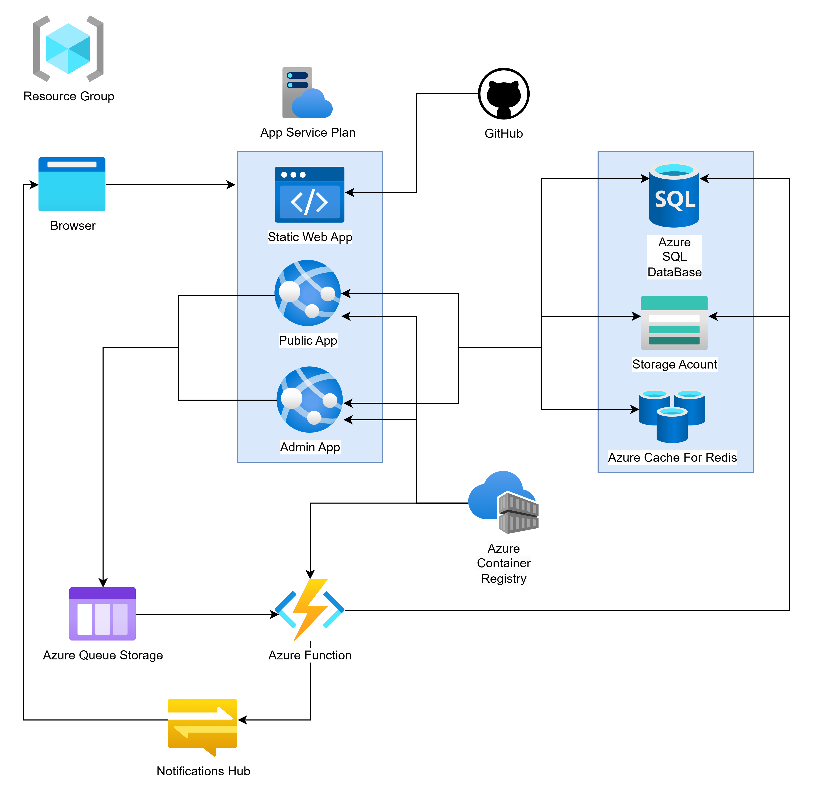
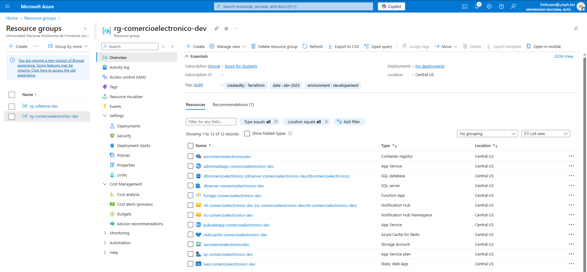

Una organización enfocada al **comercio en línea** busca evolucionar su **plataforma**
con miras a la **escalabilidad** y la **flexibilidad**. Han definido ciertos **requerimientos**
que involucran ofrecer **contenido estático**, facilitar **dos aplicaciones web** distintas
para los usuarios (**pública** y **administrativa**), manejar **tareas en segundo plano**,
contar con un **almacenamiento de archivos** y un componente que **acelere las
consultas más frecuentes**. El **objetivo** es crear una **solución** que cumpla con estos requerimientos.

> ## Repositorios 
>- [Repositorio A (Storage Account, Conteiners y Queue)](https://github.com/FranklinAmaya13/Repositorio-A)
>- [Repositorio B (App Service Plan, Web Apps, Static Web App)](https://github.com/FranklinAmaya13/Repositorio-B)
>- [Repositorio C (Data Base, Cache Redis, Functions App, ACR, Notification Hub )](https://github.com/FranklinAmaya13/Repositorio-C)

# Diagrama de Arquitectura

# Grupo de Recursos Desplegados 

# Componentes de la Arquitectura

> ## App Service Plan 
> Permite administrar los recursos compartidos por las App Services, optimizando costos y rendimiento, también nos facilita la escalabilidad automática de las aplicaciones sin preocuparse por la infraestructura subyacente.

> ## Azure App Service (Aplicaciones pública y administrativa)
> Proporciona un entorno de alojamiento gestionado para aplicaciones web, API y backend sin necesidad de administrar servidores. Es ideal para la tienda en línea (pública) y el panel de administración (privado), nos alta disponibilidad y seguridad.
>- [Web App Publica](https://pubwebapp-comercioelectronico-dev.azurewebsites.net)
>- [Web App Administrativa](https://adminwebapp-comercioelectronico-dev.azurewebsites.net)

> ## Static Web App (Contenido estático)
> Permite servir contenido estático de forma optimizada con CI/CD integrado desde GitHub Actions o Azure DevOps, ayuda a reducir la carga sobre las aplicaciones web y mejora la velocidad de carga para los usuarios finales.
>- [Static Web App](https://thankful-glacier-00caddc10.6.azurestaticapps.net)

> ## Azure SQL Database (Base de datos relacional)
> Nos ofrece una base de datos escalable y con alta disponibilidad, seguridad integrada y optimización del rendimiento, con la base de datos gestionaremos información estructurada como productos, pedidos y transacciones.

> ## Azure Cache for Redis (Optimización de consultas)
> Acelera el acceso a datos almacenando en memoria consultas frecuentes o datos temporalmente relevantes, reduciendo la carga en la base de datos y mejora la experiencia del usuario.

> ## Storage Account (Almacenamiento de archivos y colas)
> Nos proporciona almacenamiento de archivos para guardar imágenes de productos, facturas y otros documentos sin depender de la base de datos y reduciendo la carga de la base de datos.

> ## Azure Queue Storage (Mensajería asíncrona)
> Este componente gestiona la comunicación entre componentes desacoplados de manera eficiente, asegurando que tareas en segundo plano se ejecuten sin afectar el rendimiento de las aplicaciones principales.

> ## Azure Functions (Tareas en segundo plano)
> Permite ejecutar código en respuesta a eventos sin gestionar servidores, estos nos ayuda para procesos como generación de facturas, actualizaciones de inventario y procesamiento de pagos.
>- [Function App](https://funapp-comercioelectronico-dev.azurewebsites.net)

> ## Notification Hub (Notificaciones a usuarios)
> Este servicio facilita el envío masivo y en tiempo real de notificaciones push a los clientes en múltiples dispositivos y plataformas, mejorando la comunicación con los usuarios sobre actualizaciones, promociones o estado de los pedidos.

> ## Azure Container Registry (Almacenamiento de imágenes para despliegue)
> Nos permite gestionar y almacenar imágenes de contenedores de manera segura, que nos facilitando la implementación y actualización de las aplicaciones de las Web Apps o Azure Functions sin depender de un registro externo.

## Infraestructura
Separar la **infraestructura** en múltiples **repositorios** fue una experiencia que me ayudó a tener una visión más clara y estructurada del **sistema completo**. Distribuyendo las **responsabilidades** específicas en cada **repositorio**, se tiene una mejor visión de la **coordinación** que se necesita entre las distintas partes del **proyecto**.  

Esta **segmentación** ayuda a tener una mayor **organización**, dado que cada conjunto de **recursos** tiene un **propósito** bien definido, y se evitó el **desorden** que suele surgir al gestionar todo desde un solo lugar. Implica una mayor **atención** al momento de referenciar **recursos comunes**, como el **grupo de recursos**.  

Realizar las **capturas de pantalla** del **despliegue** sirve como **evidencia visual** del avance, también como una forma de registrar **configuraciones clave**, **errores inesperados** y **comportamientos** del **entorno**. Estas **capturas** ayudan a reforzar la **comprensión** del estado de la **infraestructura**, facilitando **revisiones** con los **repositorios** y sirven como **apoyo práctico** para futuras **implementaciones** o **correcciones**.

## Procesamiento Asíncrono
La decisión de realizar ciertas operaciones de manera **asíncrona** surge de la necesidad de optimizar el **rendimiento** y la **escalabilidad** del **sistema**. Si estas operaciones se ejecutaran de manera **síncrona**, pueden ser **costosas** en términos de **tiempo** y **recursos**, bloquearían la ejecución de otros **procesos**, afectando la **experiencia del usuario** y limitando la **capacidad** del **sistema** para manejar múltiples **solicitudes simultáneamente**.  

Al delegar **tareas largas** a **colas de mensajes**, se evita **sobrecargar** los **servicios principales** y se permite que las **aplicaciones** continúen respondiendo **rápidamente** a nuevas **solicitudes**.  

>- **Gestión de inventario**: La **actualización del stock** puede realizarse de manera **asíncrona** para evitar **bloqueos** en la **base de datos**, para **tiendas** con **alta demanda** y **múltiples pedidos simultáneos**.  
>- **Envío de notificaciones de confirmación**: **Confirmaciones de pedidos**, **actualizaciones de envío** pueden gestionarse en **segundo plano** para no afectar la **respuesta inmediata** al **usuario**.  

## Almacenamiento en memoria (cache)
El **almacenamiento en memoria** de **Azure Cache for Redis** permite acceder **rápidamente** a **datos** que se consultan con **frecuencia** sin necesidad de realizar **consultas repetitivas** a la **base de datos**. Esto es muy útil en **operaciones** como:  

>- **Cargar productos populares** del **comercio en línea** sin volver a hacer la **consulta** a la **base de datos** cada vez.  
>- **Manejar listas de precios** sin **impactar** la **base de datos**.  

Al reducir la cantidad de **consultas** a la **base de datos**, se **disminuye** la **carga** en el **servidor** de la **base de datos** y se **mejora** el **tiempo de respuesta**, y esto nos ayuda a crear una **experiencia más rápida** al **usuario**.  

# Tecnologías Utilizadas

- Terraform
